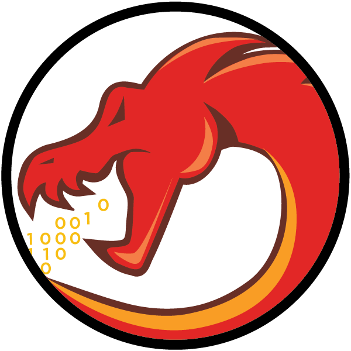

# PCode2C



The Pcode2C plugin takes a piece of the binary, disassembles it .
The plugin builds a command line invocation of the `python3 -m pcode2c` command line tool.
In order for this plugin to work you must have the `pcode2c` tool installed by running `python3 -m pip install -e .` from the root directory of this project.

# CBMC

 will bring up a menu.

CBMC is the C bounded model checker. You can use it to check for certain errors in C code lik buffer overflows. It will also attempt to check if it is possible to trigger assertions.

## Installation

To install, get a copy of [CBMC](https://github.com/diffblue/cbmc/releases/)

```bash
wget https://github.com/diffblue/cbmc/releases/download/cbmc-5.95.1/ubuntu-22.04-cbmc-5.95.1-Linux.deb
dpkg -i ubuntu-20.04-cbmc-5.95.1-Linux.deb
```

## Usage

The default option for the `C File` field will the decompiler output. This is unlikely to even parse.

To get it to work, click the button above the decompiler view that says "Export the Current Function to C". This will allow you to save a file. You may edit this file to convert it into compilable C. This fixing will require editting the function to remove any non C ghidraisms and also adding declarations and signatures to the top of the file. You do not necessarily need to include the bodies of the called functions if their behavior is not relevant for the property of interest. For example:

```C

// Extra includes
#include <stdint.h>
#include <stddef.h>

// Extra Declarations
extern int my_global;
int my_external_function(int foo);

// Ghidra exported function
int my_ghidra_exported_functin(int param_1)
{
  return my_external_function(param_1) + 1 + my_global;
}
```

The plugin combines these options into a command line invocation which can be seen in the Ghidra console.

# Compile


Compile shows a template that can help you get access to registers.

C does not support program fragments not in a function body. It will also erase any computations in the assembly that do not have externally observable effects.

For this reason, any computation you want to really happen must be written somewhere.

One useful trick is ABI abuse. In most calling conventions, the first N arguments to a C function are carried in predefined registers. By writing a function that takes N arguments, you can get access to these registers. Any edits to these registers are preserved by putting a tail call CALLBACK function in the final return.

For other registers, inline assembly must be used.
This declaration insists that the C variable `rax` can be read from the register `rax`.

```C
register uint64_t rax asm ("rax");
```

```C
WRITEREG(rax)
```

These methods are not entirely reliable, so manual inspection of the resulting assembly is still required.

This prints assembly which can be put into the binary by using the built in Ghidra assmbler. Right click on an instruction in the Ghidra listing window and select "Patch Instruction Bytes".

# Patcherex2


The Patcherex2 plugin exposes a simplified convenience interface to the [Patcherex2](https://github.com/purseclab/Patcherex2) tool. It needs it be installed like so

```bash
python3 -m pip install patcherex2
```

This is useful for patches that would not fit in place. For patches that merely replace functionality, using the in built Ghidra assembler is preferred.

For multiple patches on the same binary, you will want to build Patcherex2 script to do them in bulk.

# Elf Editing

Manually adding a segment to the binary using Ghidra is not quite trivial but also not hard.

You can find the elf program segment header.

There are a couple techniques:

Because of alignment constraints, the .text section often has unused padding at the end. This will not be loaded because the segment header has a fild

[elf.h definition of struct elf64_phdr](https://github.com/torvalds/linux/blob/5847c9777c303a792202c609bd761dceb60f4eed/include/uapi/linux/elf.h#L260)

```C
typedef struct elf64_phdr {
  Elf64_Word p_type;
  Elf64_Word p_flags;
  Elf64_Off p_offset;  /* Segment file offset */
  Elf64_Addr p_vaddr;  /* Segment virtual address */
  Elf64_Addr p_paddr;  /* Segment physical address */
  Elf64_Xword p_filesz;  /* Segment size in file */
  Elf64_Xword p_memsz;  /* Segment size in memory */
  Elf64_Xword p_align;  /* Segment alignment, file & memory */
} Elf64_Phdr;
```

When you run `readelf --segments /bin/true` or `objdump -x /bin/true` you can also see this information

```
Program Header:
    PHDR off    0x0000000000000040 vaddr 0x0000000000000040 paddr 0x0000000000000040 align 2**3
         filesz 0x00000000000002d8 memsz 0x00000000000002d8 flags r--
  INTERP off    0x0000000000000318 vaddr 0x0000000000000318 paddr 0x0000000000000318 align 2**0
         filesz 0x000000000000001c memsz 0x000000000000001c flags r--
    LOAD off    0x0000000000000000 vaddr 0x0000000000000000 paddr 0x0000000000000000 align 2**12
         filesz 0x0000000000000fc8 memsz 0x0000000000000fc8 flags r--
    LOAD off    0x0000000000001000 vaddr 0x0000000000001000 paddr 0x0000000000001000 align 2**12
         filesz 0x0000000000002991 memsz 0x0000000000002991 flags r-x
    LOAD off    0x0000000000004000 vaddr 0x0000000000004000 paddr 0x0000000000004000 align 2**12
         filesz 0x0000000000000d58 memsz 0x0000000000000d58 flags r--
    LOAD off    0x0000000000005c88 vaddr 0x0000000000006c88 paddr 0x0000000000006c88 align 2**12
         filesz 0x000000000000038c memsz 0x00000000000003a0 flags rw-
 DYNAMIC off    0x0000000000005c98 vaddr 0x0000000000006c98 paddr 0x0000000000006c98 align 2**3
         filesz 0x00000000000001f0 memsz 0x00000000000001f0 flags rw-
    NOTE off    0x0000000000000338 vaddr 0x0000000000000338 paddr 0x0000000000000338 align 2**3
         filesz 0x0000000000000030 memsz 0x0000000000000030 flags r--
    NOTE off    0x0000000000000368 vaddr 0x0000000000000368 paddr 0x0000000000000368 align 2**2
         filesz 0x0000000000000044 memsz 0x0000000000000044 flags r--
0x6474e553 off    0x0000000000000338 vaddr 0x0000000000000338 paddr 0x0000000000000338 align 2**3
         filesz 0x0000000000000030 memsz 0x0000000000000030 flags r--
EH_FRAME off    0x00000000000049c4 vaddr 0x00000000000049c4 paddr 0x00000000000049c4 align 2**2
         filesz 0x0000000000000084 memsz 0x0000000000000084 flags r--
   STACK off    0x0000000000000000 vaddr 0x0000000000000000 paddr 0x0000000000000000 align 2**4
         filesz 0x0000000000000000 memsz 0x0000000000000000 flags rw-
   RELRO off    0x0000000000005c88 vaddr 0x0000000000006c88 paddr 0x0000000000006c88 align 2**0
         filesz 0x0000000000000378 memsz 0x0000000000000378 flags r--

```

You can see this table in Ghidra at the top of the binary.

In a simple binary only one segment will be marked executable `flags r-x`

```
LOAD off    0x0000000000001000 vaddr 0x0000000000001000 paddr 0x0000000000001000 align 2**12
     filesz 0x0000000000002991 memsz 0x0000000000002991 flags r-x
```

If you click on
